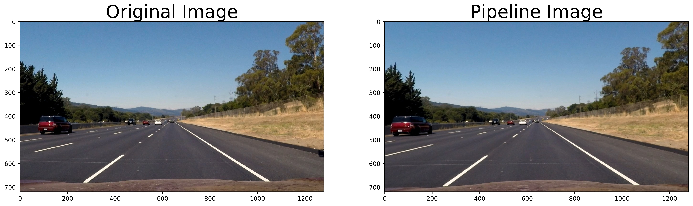

**Advanced Lane Finding Project**

The goals / steps of this project are the following:

* Compute the camera calibration matrix and distortion coefficients given a set of chessboard images.
* Apply a distortion correction to raw images.
* Use color transforms, gradients, etc., to create a thresholded binary image.
* Apply a perspective transform to rectify binary image ("birds-eye view").
* Detect lane pixels and fit to find the lane boundary.
* Determine the curvature of the lane and vehicle position with respect to center.
* Warp the detected lane boundaries back onto the original image.
* Output visual display of the lane boundaries and numerical estimation of lane curvature and vehicle position.

## Camera Calibration - Cells 2, 3, 4 and 5

1. Briefly state how you computed the camera matrix and distortion coefficients. Provide an example of a distortion corrected calibration image.

In order to calibrate the camera, i have looped through all the provided chessboard images and stored the corners using the opencv findCorners function. Once all the data has been collected, the opencv calibrateCamera function was used in order to compute the calibration matrices. Since this needs to be done once, the data was then pickled for later use. 

Here is an example of distortion correction:

 

## Single image pipeline - Cells 6, 7, 8 and 9 

### The first step is of course to correct the distortion on an image, using the calibration parameters that were computed before.

 

We can see the effects of the distortion correction by simply having a look at the red car driving on the left side. It's apparent size is visibly different in both images.

### Next step is to use a combination of color selection and gradient detection in order to create a binary image containing the detected lanes - Cell 28 (colorSpaceProcessing)

for the feature selection I used two color space transformations in order to enable thresholding on several layers:
- HLS
- HSV

Sobel gradient detection and S channel thresholding are no different than what was presented in the class. I however added two channels, H and V in order to improve performance. Thresholding H channel was used in order to reduce the influence of shadows on the road. Additionally, I used a mask in order to limit the data to our region of interest.

The figure below shows the effect of the use of the H channel. It was made using the test4.jpg image.

 

The final result of the pipeline looks like this:

 

For some reason i couldn't save the right side picture as a grayscale image. But we can still clearly see the result of the pipeline so far.

### Now that the features are selected, it's was time to change the perspective of the image - Cell 28 (warp_image)

4 points were selected manually (i know, it's not the best way), and the opencv library functions for perspective transforms were used. The result is plotted below.

| Source        | Destination   | 
|:-------------:|:-------------:| 
| 238, 685      | 400, image.shape_0        | 
| 565, 470      | 400, 0      |
| 725, 470     | 800, 0      |
| 1060, 675      | 800, image.shape_0        |

 

The lines in the warped image appear to be parallel to the lanes, which is a good indication for the correctness of the perspective transform. Off to the next step!

### Polynomial approximation of the lanes - Cell 28 (fitPolynom)

For the polynomial fitting I used the same method as in the course, with only minor changes to the minimum number of pixels required and another change on the window width. The result can be seen in the image below.

 

### Computing the radius curvature and position of the car in the lane - Cell 28 (computeCurveAndCarPos)

in cell XXX we compute the "size" in meters of a pixel in the image. Assuming the lane width is standard (3.7) and taking the origin of the polynomials, we can estimate xm_per_pix. Assuming a max range of 30m, we also get ym_per_pix.

### Pipeline results on an image (example) - Cell 29 (pipeline)

 

Results on the other images can be found under the folder output_images

## Video pipeline - Cell 29 (pipeline_vid)

The video pipeline is based on the same pipeline as for the images, of course. However, in order to increase stability, a filtering of the lane polynomial coefficients has been implemented. The video result can be found in the repository under the name "project_video_submission.mp4".

## Discussion

Lane marking detection on the left side, with the yellow solid line, is pretty stable. Detecting the non continuous lane markings, mostly on the right side in our examples, proves to be more difficult. This leads to a noticable stability difference between left and right sides when we have a look at the video. I had a look at a few difficult frames on the video, trying to understand why the estimation was sometimes way off what one could reasonably expect. The image below is from frame 593, where the estimation is unplausible on the right side.

 

The video pipeline (important: without filtering) shows the following result

 

We do not detect enough features for the right lane marking, therefore only a small section is seen and the polynomial fitting ends up predicting a sharp curve to the left (approx. 50m curve radius). 

From here we can derive several potential improvements:
- A better color space thresholding and/or using other color spaces. This would probably anyway be necessary if we want to perform well on challenging situations like the ones from the challenge videos.
- A different approach for the fitting: 
    - The "B" coefficient of the polynome (as in A.x² + B.x + C), should ideally be very close to 0, since this coefficient represents the angle between the car and the lane marking, and since the car seem to be driving parallel to the street (no lane changes for instance). A possible improvement would be to include constraints for the fitting, in order to avoid getting such an off course estimation as shown above.
    - One additional improvement would be to make the assumption that both lanes are parallel to each other: this would mean that A and B are equal for the left and right side, only C can be different (represents the lateral offset to the lane). If we could transform the lane pixels into a space where the lateral offset C does not make any difference anymore, we would end up having more data in order to compute the best possible approximation of A and B. This would make the fitting very robust for situations like the one described above.
    - A simple solution for dealing with the problem at hand is to simply filter the values of the polynomes over time, after all roads are built according to specific standards and the lane curvature is supposed to be change linearly and pretty smoothly (especially on highways).

To limit this issue, I added a filtering process that smoothed out the estimation.
